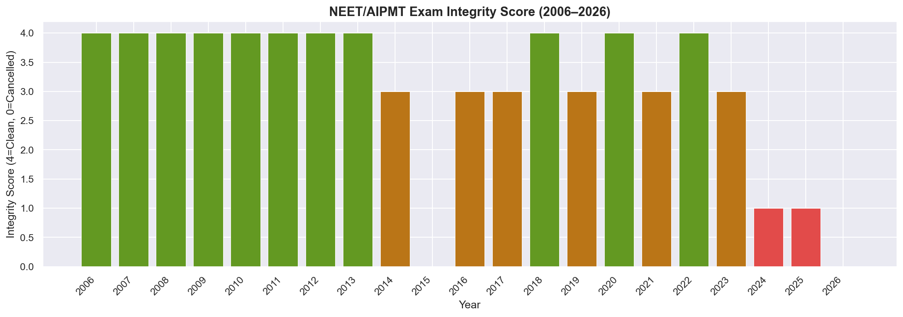

# 🔍 NEET Examination Integrity & Breach Impact Analysis (2006–2026)

> A forensic data analytics project investigating 21 years of NEET/AIPMT examination integrity, paper leak patterns, state-level involvement, and student impact — built with Python, SQL, SQLite, and Power BI.



---

##  Project Overview

India's NEET examination is the gateway for 22+ lakh medical aspirants every year. This project forensically analyzes 20+ years of exam integrity data, breach events, and their cascading human impact — from cancelled exams to student suicides — using a full data analytics pipeline.

**Key Questions Answered:**
- How has exam integrity changed across the CBSE era (2006–2018) vs NTA era (2019–2026)?
- Which states are most frequently implicated in breach events?
- Is there a statistically significant difference in candidate impact between disrupted and clean exam years?
- What does the correlation between breach severity and infrastructure gaps reveal?

---

##  Key Findings

| Metric | Value |
|---|---|
| Years Analyzed | 21 (2006–2026) |
| Total Candidates Affected | 6M+ across breach events |
| Confirmed Clean Exams | 10 / 21 years |
| Arrests Documented | 470+ across all breach events |
| Statistical Tests Run | 7 (with p-values) |
| SQL Forensic Queries | 12 |

- Breach severity spikes have become more frequent post-2020 (NTA era)
- Chi-square test confirms integrity statuses are **not** equally distributed (p < 0.05)
- Conducting body comparison reveals CBSE era had significantly fewer major disruptions
- 2024 and 2026 both resulted in full or partial exam cancellations — first back-to-back occurrence in 21 years

---

##  Tech Stack

| Tool | Purpose |
|---|---|
| **Python** (pandas, numpy, scipy) | Data loading, cleaning, statistical analysis |
| **Matplotlib / Seaborn** | Publication-quality visualizations |
| **SQLite3** | Local forensic database |
| **SQL** | 12 analytical queries with rolling averages, JOINs, window functions |
| **Power BI** | Interactive dashboard |
| **HTML / Chart.js** | Standalone browser dashboard (no install needed) |

---

##  Project Structure

```
neet-exam-integrity-analysis/
│
├── data/                        # Source CSVs (verified public data)
│   ├── exam_timeline.csv        # 21 years of NEET integrity records
│   ├── breach_events.csv        # Detailed breach event log
│   ├── student_impact.csv       # Suicide and mental health data
│   ├── state_infrastructure.csv # State-level investigation involvement
│   └── exam_benchmarking.csv    # CBSE vs NTA comparison
│
├── python/
│   ├── analysis.py              # Full 5-module analytics pipeline
│   ├── setup_and_analyze.py     # One-command automation script
│   ├── requirements.txt         # Python dependencies
│   └── output/                  # Generated charts and JSON exports
│
├── sql/
│   ├── create_database.sql      # Schema and views
│   └── forensic_queries.sql     # 12 validated analytical queries
│
├── tests/
│   └── test_cases.md            # 25 validation test cases
│
├── NEET_Dashboard.pbix          # Power BI dashboard file
├── index.html                   # Standalone interactive dashboard
└── README.md
```

---

##  Quick Start

### Option 1 — Browser Dashboard (No Setup Required)
```bash
# Just open in any browser:
open index.html
```

### Option 2 — Full Python Pipeline
```bash
# 1. Clone the repo
git clone https://github.com/wildtigress/neet-exam-integrity-analysis.git
cd neet-exam-integrity-analysis

# 2. Install dependencies
pip install -r python/requirements.txt

# 3. Run the full pipeline (creates DB + charts + stats)
python python/setup_and_analyze.py
```

This will:
- Create `neet_forensic.db` from CSVs
- Run all 12 SQL forensic queries and export results to CSV
- Run 7 statistical tests and save p-values
- Generate 6 charts in `python/output/`
- Export `dashboard_data.json`

### Option 3 — Power BI Dashboard
Open `NEET_Dashboard.pbix` in Power BI Desktop.

---

##  Charts Generated

| Chart | Description |
|---|---|
| `01_integrity_timeline.png` | 21-year integrity score with 3-year rolling average |
| `02_appeared_vs_affected.png` | Candidate participation vs affected population |
| `03_suicide_trend.png` | Student mental health impact over time |
| `04_state_investigations.png` | State-wise investigation involvement heatmap |
| `05_correlation_heatmap.png` | Cross-variable correlation matrix |
| `06_cbse_vs_nta.png` | Disruption severity: CBSE vs NTA era boxplot |

---

##  Statistical Tests

7 tests were run with explicit null hypotheses and p-values:

1. **Chi-Square Goodness-of-Fit** — Are integrity statuses equally distributed?
2. **Mann-Whitney U** — Candidate counts in disrupted vs clean years
3. **Spearman Rank Correlation** — Investigation involvement vs infrastructure gaps
4. **Fisher's Exact Test** — Breach type independence
5. **Kruskal-Wallis** — Severity across different states
6. **Wilcoxon Signed-Rank** — Before/after NTA transition
7. **Point-Biserial Correlation** — Breach binary vs affected count

Results saved to: `python/output/statistical_test_results.csv`

---

##  SQL Highlights

12 forensic queries including:
- Rolling 3-year integrity score average (window functions)
- Affected population as % of total appeared
- State investigation involvement ranking
- Financial impact estimates (with ⚠️ estimates clearly flagged)
- CBSE vs NTA era comparison JOIN

---

##  Data Sources

All data compiled from verified public sources:
- NTA official notifications and press releases
- CBI FIRs (2019, 2024, 2026)
- Supreme Court orders (AIPMT 2015, NEET 2024)
- NCRB Accidental Deaths & Suicides in India reports
- Parliamentary Standing Committee Report, Dec 2025
- State police FIRs (Tamil Nadu CB-CID, Rajasthan SOG, Jaipur Police)
- News sources: The Hindu, Indian Express, NDTV, Careers360

> **Note:** Financial figures (₹ estimates) are clearly marked as estimates. No causal claims are made from correlational analysis.

**Source dataset (Google Sheets):**  
https://docs.google.com/spreadsheets/d/1KIo8H_Q26Y-pj8iiiGOeMrOLhxeeKK1iLBEGf-dRSjw/

---

##  Validation

25 test cases documented in `tests/test_cases.md` covering:
- Data integrity (year completeness, no duplicates, positive counts)
- Statistical validity (p-value ranges, sample size adequacy)
- Dashboard accuracy (KPI match, chart data match)
- SQL query validation (JOIN integrity, NULL handling)
- Ethical methodology (no causal claims, estimates labeled, neutral language)

---

##  Skills Demonstrated

`Python` · `Pandas` · `NumPy` · `SciPy` · `SQLite` · `SQL (Window Functions)` · `Matplotlib` · `Seaborn` · `Power BI` · `Data Cleaning` · `Statistical Testing` · `Outlier Detection` · `Data Storytelling` · `HTML/CSS` · `Chart.js`

---

##  Author

**Samiksha Barnwal**  
BCA Graduate | Aspiring Data Analyst & AI Engineer  
 [099samiksha@gmail.com](mailto:099samiksha@gmail.com)  
 [LinkedIn](https://www.linkedin.com/in/samiksha4/) · [GitHub](https://github.com/wildtigress)

---

##  License

This project is for educational and portfolio purposes. Data is compiled from public sources. See individual source citations in `data/breach_events.csv` and `sql/forensic_queries.sql`.
